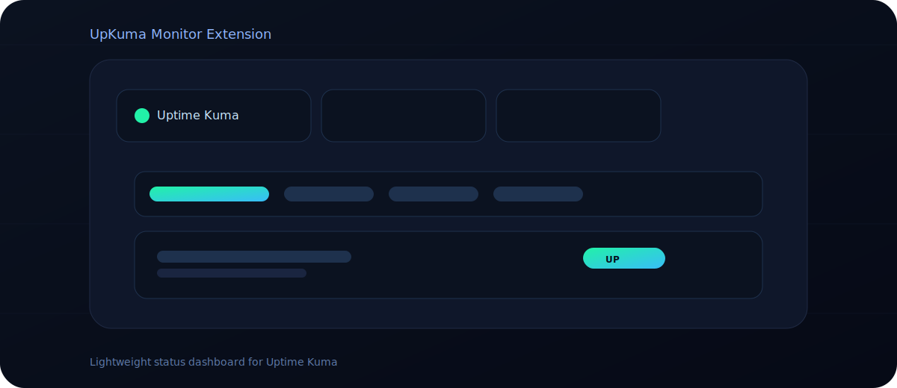

# UpKuma Monitor Extension

A lightweight Chrome extension that gives you a quick, glanceable view of your **Uptime Kuma** monitors. It connects to your existing Uptime Kuma instance and shows status counts, response times, and recent updates — right inside the browser.

## What it does
- Connects to your **Uptime Kuma** server via the `/metrics` endpoint
- Displays **total / up / down / pending** counts
- Shows **response time** and **last updated** per monitor
- Supports **light/dark** themes and **Chinese/English** UI
- Optional **API token** support
- Configurable **auto‑refresh** (default 5 minutes)

> Only features already implemented are listed here.

## Install (Developer Mode)
1. Open `chrome://extensions`
2. Enable **Developer mode**
3. Click **Load unpacked**
4. Select the project folder

## Configuration
- **Kuma URL**: e.g. `https://your-kuma.example.com`
- **API Token** (optional): if your `/metrics` endpoint is protected
- **Refresh Interval**: 1–30 minutes

## Notes
- The extension reads **Prometheus metrics** from Uptime Kuma
- Keep Chrome open for background refresh to work

---
Built for fast monitoring, without leaving your workflow.
